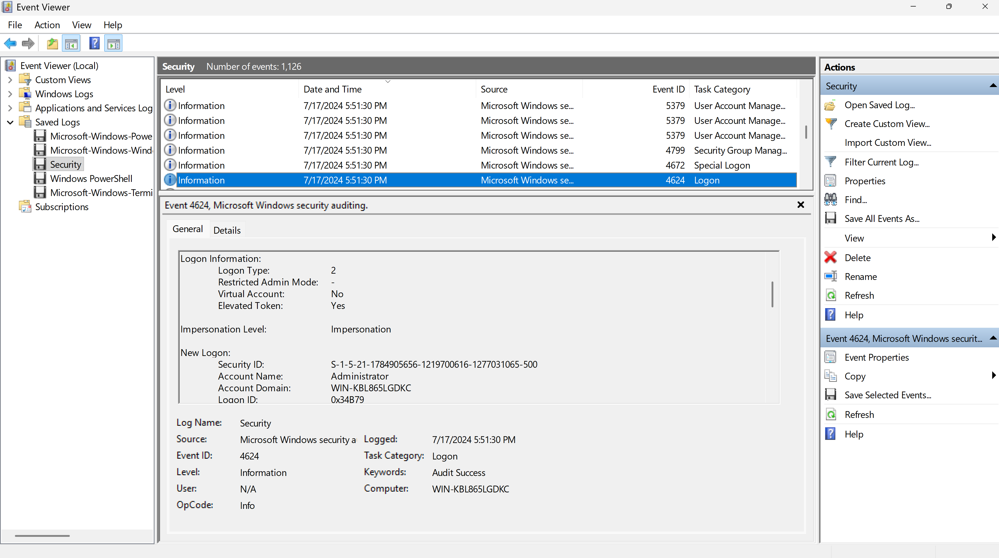
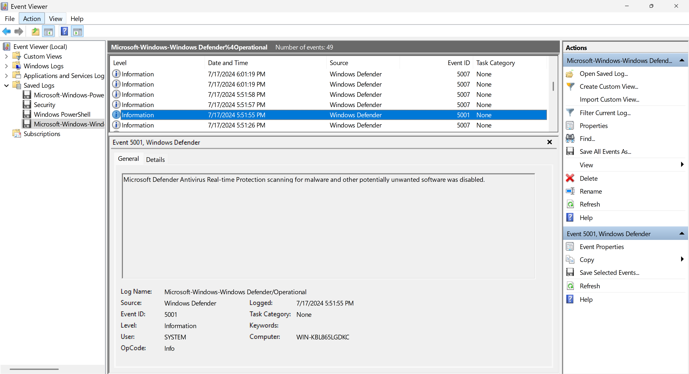
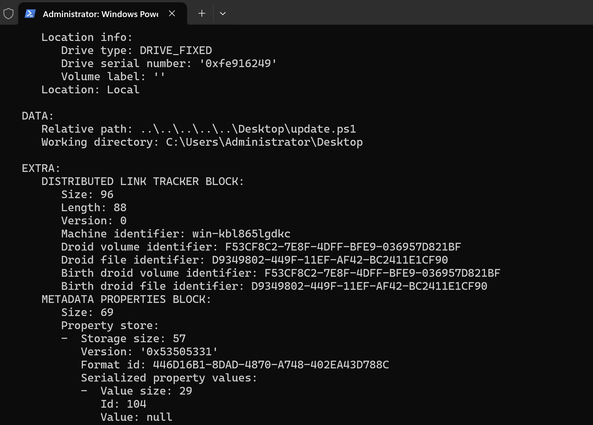
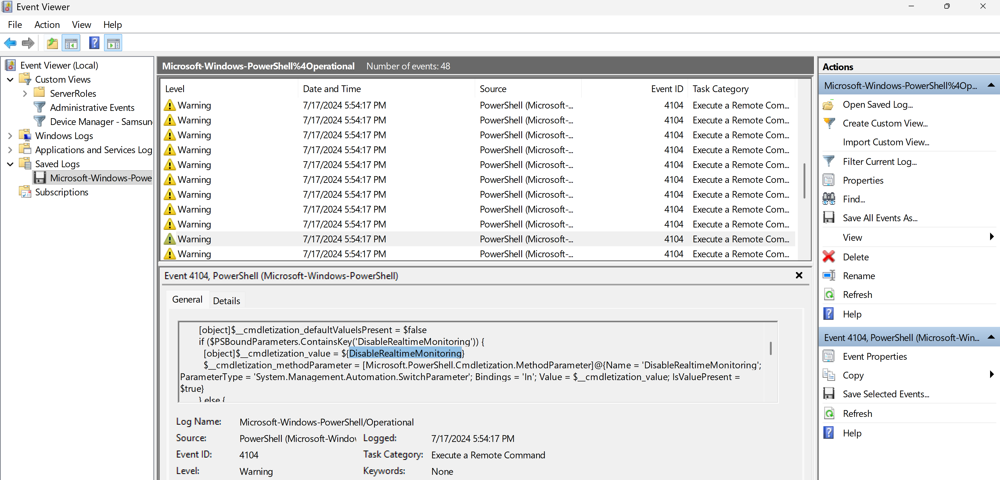
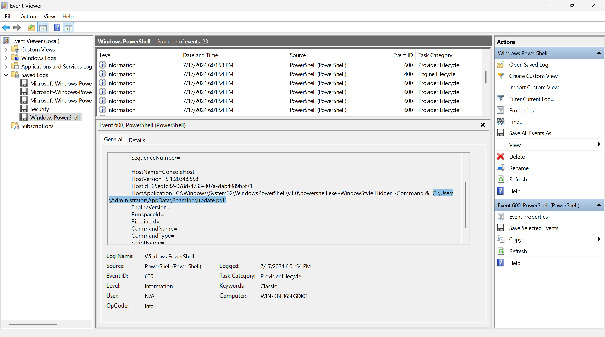
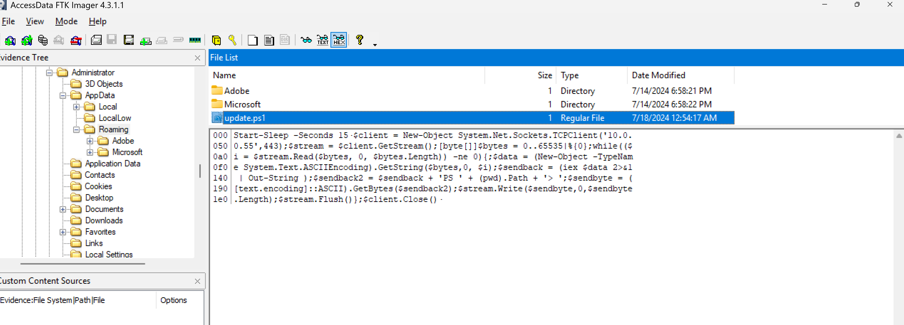

# 🔍 DFIR Case Study: Reverse Shell & Lateral Movement Investigation

## 📌 Project Overview

This project demonstrates investigating an Extended Detection and Response (XDR) alert flagged on a Windows Server 2022 system (IP: `10.0.0.2`), simulating an incident for a Security Operations Center (SOC). The alert indicated the download and execution of a suspicious file (`update.ps1`) and subsequent unauthorized network traffic over port `443`. My objective was to analyze a provided disk image, reconstruct the attack timeline, identify the infection vector, and provide actionable remediation steps.

### Tools Used:
* **Exterro FTK Imager (v4.3)**: For mounting and analyzing the disk image and extracting evidence.
* **Windows Event Viewer**: For correlating system, security, and PowerShell operational logs.
* **LnkParse3**: For parsing shortcut files to trace the origin of the malicious payload.

---

## 📋 Executive Summary

Analysis of the provided disk image revealed a highly targeted attack rather than a random malware infection. The threat actor compromised a local Administrator account and accessed the virtualized Windows Server system, which was isolated from the internet. The attacker virtually or physically mounted a SanDisk Cruzer Snap USB drive, disabled Windows Defender and the Windows Firewall, and executed a PowerShell script. This initial script established persistence via a scheduled task and downloaded a secondary payload from an internal device (`10.0.0.55`) to establish a reverse shell, facilitating lateral movement across the network.

---

## 🛑 Indicators of Compromise (IOCs)

* **Malicious Files**: `update.ps1` (Initial payload on Desktop), `update.ps1` (Secondary payload in `AppData\Roaming`; they share the same name but were completely different scripts).
* **Malicious IP / Port**: `10.0.0.55` over port `443` (Reverse shell destination).
* **Hardware IOC**: SanDisk Cruzer Snap USB flash drive (GUID: `{D93497F0-449F-11EF-AF42-BC2411E1CF90}`).
* **Persistence Mechanism**: Scheduled task named "update" triggered at logon.

---

## ⏱️ Investigation Timeline (July 17, 2024)

* **05:51:23 PM**: The operating system began initializing after being offline since July 14.
* **05:51:30 PM**: The attacker successfully logged onto the console using the Administrator account.

* **05:51:55 PM**: Windows Defender real-time protection was manually disabled.

* **05:52:30 PM**: The Windows Firewall was disabled by the attacker.
* **05:54:03 PM**: A SanDisk Cruzer Snap USB flash drive was mounted and assigned drive letter `E:\`.
* **05:54:14 PM**: The initial malicious script (`update.ps1`) was executed from the Desktop. LnkParse3 analysis confirmed the file was copied directly from the USB drive, not downloaded from the internet; the last 12 hex bytes of the "Droid File Identifier" and "Birth Droid File Identifier" are identical to the GUID of the USB drive.

* **05:54:17 PM**: PowerShell logs confirm the script altered the execution policy, disabled real-time monitoring, downloaded a secondary script also named `update.ps1` from `10.0.0.55`, registered a scheduled task, and forced a system reboot.

* **05:54:18 PM**: The server initiated a forced logoff and shutdown.
* **06:01:16 PM**: The system finished rebooting and processes resumed.
* **06:01:54 PM**: The scheduled task triggered upon initialization, silently executing the secondary `update.ps1` from the Administrator's `AppData\Roaming` folder.

* **Post-Execution**: The script initiated a 15-second sleep cycle before establishing a TCP client connection to `10.0.0.55` on port `443`, granting the attacker a live reverse shell.

--- 

## 🛡️ Remediation & Recommendations

To eradicate the threat and secure the environment, I recommended the following SOC actions:

### Containment & Eradication

**1. Network Isolation**: Immediately disconnect the compromised server and the internal device at `10.0.0.55` from the local network.

**2. Firewall Blocking**: Block all traffic to and from `10.0.0.55` at the firewall level to prevent further lateral movement.

**3. Account Suspension**: Disable the compromised Administrator account and force password resets for any associated accounts.

**4. System Wipe**: After capturing forensic images, completely wipe both the server and the `10.0.0.55` system, as malware scans are insufficient when an attacker has held administrative access.

### Recovery & Prevention

**1. System Restoration**: Rebuild the affected systems using known good backups and heavily monitor their outbound traffic upon restoration.

**2. Access Controls**: Restrict physical access to the server room and disable unauthorized USB pass-through on the hypervisor.

**3. Authentication Upgrades**: Enforce Multi-Factor Authentication (MFA) for all administrative accounts and ensure the Principle of Least Privilege is strictly followed.

**4. Detection Engineering**: Create new XDR detection rules focused specifically on the PowerShell execution behaviors observed in this incident.
